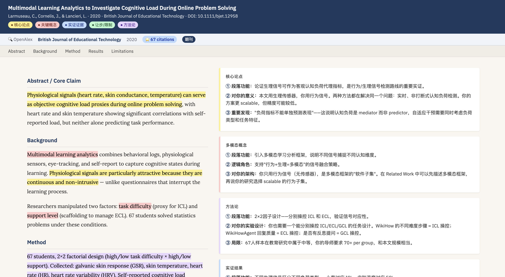

[English](README.md) | [中文](README.zh.md)

# Paperwise — Academic Paper Skill for Claude Code

> Turn any paper into a **browser-readable annotated webpage** — dual-column layout, color-coded logic highlights, and per-paragraph annotation cards. Powered by OpenAlex. Zero API keys required.



## What it does

| Command | Output |
|---------|--------|
| `/paper find "cognitive load LLM"` | Searches OpenAlex → generates Digest HTML with top N overview cards |
| `/paper read /path/to/file.pdf` | Fully annotates a single local PDF |
| `/paper digest` | Daily digest of new arxiv papers matching your keywords |
| `/paper cite [[Author-YYYY-note]]` | Generates APA 7th + BibTeX from an existing annotation |

Each annotation is a **self-contained HTML file** with:
- **Paper Quality Bar** — source, venue, year, citation tier badge (🔥 high · ⭐ important · ✓ valid · 📄 preprint)
- **5-color logical highlights** — thesis · concept · evidence · concession · methodology
- **Dual-column layout** — original text on the left, annotation cards on the right
- **Argument structure overview** at the bottom — full logical skeleton of the paper
- **One-click copy buttons** for APA and BibTeX citations

## Installation

Copy `SKILL.md` into your project's skills directory:

```
your-project/
└── .agents/
    └── skills/
        └── paper/
            ├── SKILL.md
            └── references/
                └── template.css   ← customizable CSS for all HTML output
```

Then run `/paper find "your topic"` in Claude Code. That's it.

## Configuration

Edit the `## Default Config` block at the top of `SKILL.md`. All fields are optional.

```yaml
output_dir: "./papers"        # where to save HTML files

venues: [CHI, ACL, NeurIPS, ...]   # venues for badge tagging
keywords: [...]                     # default keywords for /paper digest

min_citations: 5              # filter threshold for /paper find
daily_max: 10                 # max papers per /paper digest run

annotation_lang: zh           # zh = Chinese | en = English
                              # override per-command: --lang en

openalex_email: ""            # optional: join OpenAlex Polite Pool (higher rate limits)
semantic_scholar_api_key: ""  # optional secondary source
```

**Per-project override** — add to your project's `CLAUDE.md`:
```
paper_output_dir: 30_Research
paper_annotation_lang: en
```

## Usage

### Find papers

```
/paper find "retrieval augmented generation"
/paper find "transformer attention" --top 10
/paper find "transformer attention" 10            # bare number = --top 10
/paper find "diffusion models" --source venues    # peer-reviewed only (config venues list)
/paper find "LLM agents 2025" --source arxiv      # latest preprints only
/paper find "X" --lang en                         # English annotations

# Local PDF digest — no API calls needed:
/paper find --local ~/Downloads/papers/           # all PDFs in folder
/paper find --local a.pdf b.pdf c.pdf             # specific files
/paper find --local ~/Downloads/ --top 3          # limit to 3 files
```

Output is organized automatically:

```
papers/
├── {Author-YYYY-keyword}.html        ← /paper read output (flat)
├── FindResults/
│   ├── find-2026-03-14-1430-cognitive-load-llm.html    ← /paper find
│   └── find-local-2026-03-14-1445-downloads.html       ← /paper find --local
└── PaperDigests/
    └── 2026-03-14-digest.html                           ← /paper digest
```

Re-running the same query skips existing files and marks them `[already exists]` in the summary.

### Read a local PDF

```
/paper read ~/Downloads/paper.pdf
/paper read paper.pdf --context "Week 3 of NLP course"
/paper read paper.pdf --questions "Q1: What is the method? Q2: How does it compare?"
```

### Daily digest

```
/paper digest
```

Fetches today's new arxiv papers matching your configured keywords. Saves to `{output_dir}/PaperDigests/YYYY-MM-DD-digest.html`.

### Generate citation

```
/paper cite [[Jin-2025-llm-teachable-agent]]
```

Outputs APA 7th + BibTeX directly. Nothing saved — just copy from the terminal.

## `--source` flag

| Flag | Strategy | Ranking | Best for |
|------|----------|---------|----------|
| *(default)* | 2× OpenAlex (by citations + by year), merged | `0.5 relevance + 0.3 log(citations) + 0.2 recency` | Balanced: classics + recent |
| `--source venues` | OpenAlex only, only papers matching config `venues` list | `0.5 relevance + 0.5 log(citations)` | Peer-reviewed only |
| `--source arxiv` | arxiv only | `0.5 relevance + 0.5 recency` | Latest preprints |
| `--local /path/` | Local PDFs only — no API calls | Alphabetical, truncated to `--top N` | Offline / existing downloads |

The default mode makes **two** API calls (sorted by citations, then by year) so both highly-cited classics and recent publications appear in results.

> **Flag syntax is flexible** — flags can be written with or without `--`. Claude accepts natural language equivalents: `top 5`, `source venues`, `local /path/`, `questions "..."`.

## Annotation modes

**Mode B (default):** Logic analysis. Right-column cards break down each paragraph's function, logical role, and rhetorical technique. Works with zero configuration.

**Mode A (`--questions`):** Question-driven annotation. Highlights and cards are organized around your specific research questions.

```
# Inline questions:
/paper read paper.pdf --questions "Q1: What method? Q2: How does it compare to baselines?"

# Interactive (Claude asks first):
/paper read paper.pdf --questions
# → Claude: "请输入你的阅读问题（每行一个，或逗号分隔，最多6个）："

# Labels are optional — all formats accepted:
/paper read paper.pdf --questions "method, dataset size, limitations"
/paper read paper.pdf --questions "method; dataset size; limitations"
```

**Mode A output:**
- Colors assigned per-question (Q1 = color 1, Q2 = color 2, …)
- Annotation cards explain which question each paragraph addresses
- Bottom section = Q&A Worksheet (one card per question: core argument + key evidence + limitation)

## Data sources

| Source | Role | API key? |
|--------|------|----------|
| **OpenAlex** | Primary | None required |
| **arxiv** | Digest + fallback | None required |
| **Semantic Scholar** | Optional secondary | Free key |

## Requirements

- Claude Code
- Network access (OpenAlex / arxiv APIs) — not needed for `--local` or `read`
- No API keys required for basic use

## License

MIT © [sjqsgg](https://github.com/sjqsgg)
